# 書いたMarkdownをStorybookで確認したい

## 実際のサイト上での見た目を確認できるようにしたい

今どきMarkdown書いて公開したいとなったらQiitaなりZennなりAstroを使うなりが一般的かと思います
しかしこのサイトは素のReactで[remark](https://github.com/remarkjs/remark)/[rehype](https://github.com/rehypejs/rehype)を使ってMarkdownをいい感じに表示させる方法を取っています
筆者はエディターとしてvscodeを使っていますので、拡張機能を使って編集中のMarkdownのプレビューできます

ですが、例えば↓のような図

```mermaid
architecture-beta
    group api(simple-icons:awslambda)[API]

    service db(logos:aws-aurora)[Database] in api
    service server(logos:aws-ec2)[Server] in api

    db:L -- R:server
```



上記のsvgは[mermaid](https://mermaid.js.org/)記法によって記述されています。ベタの画像ではありません。なのでvscodeのMarkdown拡張だけではうまくいきません
mermaidを表示させるだけならばvscodeにも対応する拡張機能がありますが、左上のスタイリッシュなAWS Lambdaのアイコンは表示できません
このアイコンは[iconify.design](https://icon-sets.iconify.design/)のうちのsimple-iconsを使っていますが、これは取ってこれないようです

当サイト上ではsimple-iconsを表示させるため、以下のようにmermaidにiconの居場所を教えてあげています
```typescript
import mermaid from "mermaid";

mermaid.initialize({ theme: getTheme() });
mermaid.registerIconPacks([
  {
    name: "logos",
    loader: () => import("@iconify-json/logos").then(({ icons }) => icons),
  },
  {
    name: "simple-icons",
    loader: () =>
      import("@iconify-json/simple-icons").then(({ icons }) => icons),
  },
]);
```

こういう設定をしていると、「設定漏れていないだろうか…」みたいな心配が出ます。なので実際にフロントを動かしつつMarkdownを表示させたくなります
他にも色々vscodeの拡張機能とは見た目違う部分も多々ありますしね

今現在の設計だと、生MarkdownはAWS S3に保持してそれを取って表示させています
なのでlocalstackを構築してそこに置けばlocal環境での表示確認は可能です
ですが、Markdownの持つ場所を変えたりすると都度local環境でのMarkdownの持ち方を変えなきゃいけなかったりして面倒です。~~そもそもまだlocal環境というものを作ってない~~
確認のためだけのコンポーネントをちくいち作って`<App />`と差し替えるみたいなこともやりたくはありません

ということで、Storybookを使って、localにMarkdownをポンと置くだけで実際の表示を確認したくなり、今回それを実際作り込みました

## Storybookの設定

筆者自身Storybookの設定には詳しくないので非常に簡単な内容になります

### install

[書いてあるとおり](https://storybook.js.org/docs/get-started/install)するだけ
```sh
npx storybook@latest init
```

### main.tsを書く

以下のようにmain.tsの`staticDirs`にMarkdownを詰め込んでおくディレクトリを指定します。
以前のバージョンはStorybookを起動する際の引数に `-s` を指定して静的ファイルを取り回していたようです
```typescript
import type { StorybookConfig } from "@storybook/react-vite";

const config: StorybookConfig = {
  stories: [
    "../src/**/*.mdx",
    "../src/**/*.stories.@(js|jsx|mjs|ts|tsx)",
    "../story-util/**/*.stories.@(js|jsx|mjs|ts|tsx)",
  ],
  staticDirs: ["../markdown.local"],
  addons: [
    "@storybook/addon-onboarding",
    "@storybook/addon-essentials",
    "@chromatic-com/storybook",
    "@storybook/addon-interactions",
  ],
  framework: {
    name: "@storybook/react-vite",
    options: {},
  },
};
export default config;
```

### MarkdownPreview.stories.tsx

前項でstaticDirsを指定したため、fetch APIによってファイルの内容を取ってこれます
```typescript
function MarkdownPreview({ src }: { src: string }) {
  const [text, setText] = useState<string>();
  useEffect(() => {
    fetch(`/${src}`)
      .then((r) => r.text())
      .then(setText);
  }, []);
  if (!text) return <></>;
  return (
    <div className="overflow-auto">
      <Markdown text={text} />
    </div>
  );
}
```

後は以下のようにして`markdown.local`配下にあるマークダウンの名前をsrcに渡してあげればOKです

```typescript
function MarkdownPreview({ src }: { src: string }) {
  // 中略
}

const meta: Meta<typeof MarkdownPreview> = {
  component: MarkdownPreview,
};

export default meta;
type Story = StoryObj<typeof MarkdownPreview>;

export const _20250127: Story = {
  args: {
    src: "20250127.md",
  },
};
export const _20250219: Story = {
  args: {
    src: "20250219.md",
  },
};
```

### 実際の表示


ええやん:v:

## まとめ

ということでStorybookでMarkdownを楽に確認できるようにしてみましたが、以下のような利益が得られました

- 実際どんな表示になるかの確認が容易になった
- Markdownをファイルでまとめて置くだけで良くなったので管理がしやすくなった
- 実際の表示で気になる部分もわかりやすくなったのでremark/rehypeの拡張やcssの改善点を見つけやすくなった
  - 今回の記事から絵文字をきれいに表示できるようにした
  - 画像を楽に保存できるようにする方法が現状ない改善点がはっきりわかった

一方物足りないポイントとしては以下のようなものがありました

- 都度reloadする必要がある
  - 基本的にはvscodeで確認`→たまにStorybookで確認、という流れで書くことになりました
    - `MarkdownPreview`コンポーネントを改修しても良さそう
- 記事ごとに`export const ファイル名: Story =...`を追記するのがだるい
  - 大した記述量ではないが負けた気分になる

個人的には「個人開発やし別にStorybookまではいらんやろwwwww」みたいなナメた認識を改めるきっかけになったことが最大の収穫だと思いました。便利やコレ

ということでStorybookともっとお友達になってもっとこき使ってやろうと思いました。皆様のこき使いの一歩としてこの記事の内容がお役に立てば幸いです