# このサイトについて

個人的な技術検証のために作成したサイトです
たまに誰かの役に立つかもしれない記事が投稿されています
（←の一覧からどうぞ）

## アーキテクチャ

構成図はこう。めっちゃ簡単

```mermaid
architecture-beta
  group aws(simple-icons:amazonaws)[AWS]
  service static_files(logos:aws-s3)[Static Files] in aws
  service markdowns(logos:aws-s3)[Markdowns] in aws

  group gcp(logos:google-cloud)[GCP]
  group appengine(server)[App Engine] in gcp
  service golang(logos:go)[Go] in appengine

  group db(database)[DB]
  service neo4j(simple-icons:neo4j)[neo4j] in db

  static_files:R -- L:golang
  markdowns:R -- L:static_files
  golang:B -- T:neo4j
```

### AWS S3

素で使っているのでCloudFrontも使ってないしhttpsでもないしhttp/1.1でファイルを返してくれている
おまけにclassはIA。とにかく節約に全振りしている

#### Static Files

静的ファイルのホスティングに利用
こいつがappengineのAPIを叩くなり、マークダウンの本体を取りに行ったりする

#### Markdowns

マークダウンをファイルそのまんまで保持
DBの中に本文をベタで保存するのがいいとは思うけどS3で持つ方が圧倒的に安いので…

### GCP

Golangでバックエンドサーバーを構築。フレームワークは[gin](https://github.com/gin-gonic/gin)
これだけならほぼ**無料**という安直な理由で選択された

### DB

[neo4j](https://neo4j.com/)。
単にデータを持つだけなら適当なRDBでいいけどグラフDBを触ってみたかったので採用。neo4j Auraは無料プランがあるし
グラフDBの限界を実感できるレベルまで作り込めたら一番うれしい

## 作業フロー

### Markdownを書く時

- Markdownを書く
- バックエンド側のリポジトリでCLIツールも書いてあるのでそいつでS3にMarkdownをアップロード、neo4jにURLなどのデータを保持

### ソースコード更新の時

- mainブランチ更新時のGitHub Actionsでやってます

## 今後の展望

業務ではGCPばかりなので、予算の範囲内でAWSの担う範囲を広げて経験を積みたい

- とりあえず生S3じゃなくてCloudFront使いたいよね
- 普通のVPCの構成だと維持費高くつくしミニPC買ってそいつをAWSを連携させたいよね
- ↑みたいなのもこのサイト上からサクッと管理できるようにしたいよね
