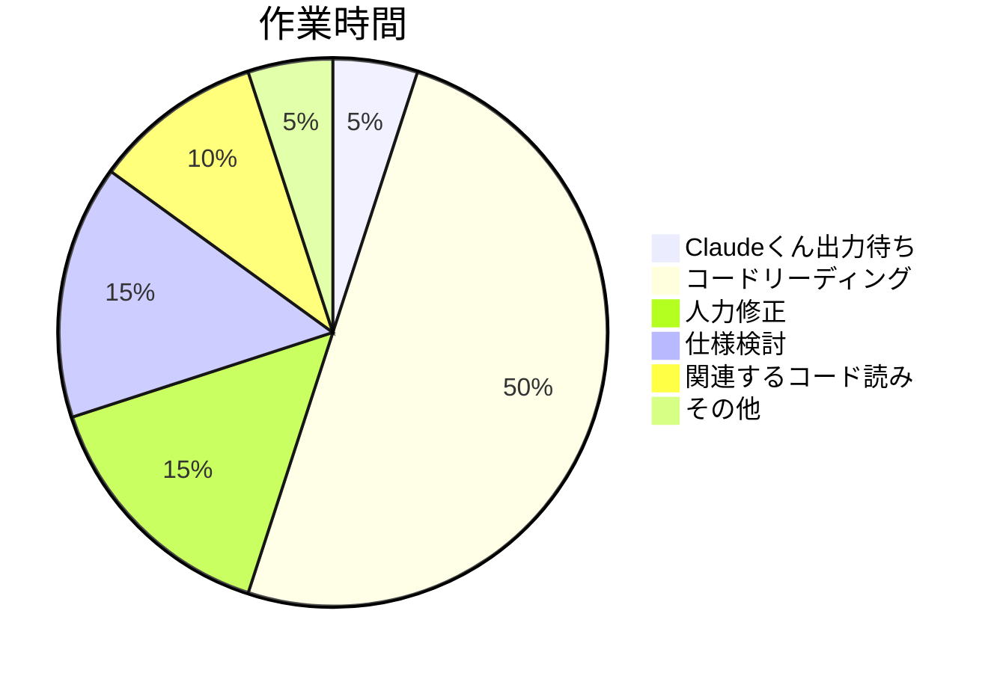

# Claude3.7で手っ取り早く拡張機能を作って欲しかった

課金不要の生成AIについてはそれになりにお付き合いさせていただいておりましたが、このたびリリースされたClaude 3.7 Sonnetの性能がいよいよとんでもない雰囲気になっていましたので、流石に財布の紐を緩めて/彼女?/を招聘しました

今回はStable Diffusion webui forgeの拡張機能を作ってもらうことで、生成AIによるCodingに入門しつつかねがねより感じていた不便を解消してもらおうと思います

## 作ってもらったもの

本題はDev with Claudeくんの感想ですが、前提共有のため作ってもらったものの説明をします
Stable Diffusion txt2img(テキストから画像生成)の入力補助をする拡張機能を作ります
素のuiでは、ポジティブプロンプトとネガティブプロンプトに直接文字を入力していくので以下のような不便がありました

- `positive: realistic, photo / negative: anime, manga`としていたが漫画調のも見たい、となった場合変更が面倒
  - ポジティブプロンプトとネガティブプロンプトから付随する単語を見つけて入力欄を差し替える必要があります。関連する単語があるともっと面倒です
- `(beautiful landascape:2)` などとして重要性を指定できるが、入力が面倒でtypoを誘発する
  - `(Mr. beast \(YouTuber\):1.5)`など、注釈のために()を使っている場合そのエスケープもする必要があって更に面倒
- 構造がないため、どこからどこまでで何を表現しようとしているかがわかりづらくなっていく
  - プロンプトは順番が重要。品質 -> アートスタイル -> 背景...と入力しているところに`mountain` とか入れたいなら、背景の場所を探してそこに差し込む必要があります

これらを解消するため、以下のような機能を作ってもらいました。

- グループの中に単語をまとめられる
  - グループには名前がつけられる
  - グループの配下に更にグループを持てる
  - トグルで閉じられる
- グループ/単語は、
  - 同じ階層の中で順序を入れ替えられる
  - 名前の先頭に`n!`があればポジティブ<->ネガティブを反転させる
    - `n!グループ`配下の`n!単語`は二回ポジネガが反転して最終的にポジティブプロンプトになる
- 重要度指定用の欄を単語ごとに設けて単語そのものの入力と分離する
- 入力情報をlocalStorageに保持し随時保存。一旦ページを閉じて再度UIを開いたら自動的にロードされる
- この入力機能は本来のプロンプト入力欄の下部に表示する

以下が完成品の使用例です。リアルなライオンとイラスト調のライオンを出力してみました
リアルとイラスト調の切り替えは `style` グループの名前を`n!style`と変更するだけでアートスタイルの指定が一括で全て反転できるので、プロンプトの変更の手間が大幅に削減されました

以下がリアル調のライオンで、


こっちがイラスト調のライオンです
`n!style`とグループ名を変更したことで、その内部の単語のネガポジがすべて反転しています


## 作業に要したもの

### 時間

概ね15時間ぐらい？　土曜の朝から25時ぐらいまで作業していました
ぐだぐだだらだら作業していたので15時間全力を出していたわけではないですがもっとこう…3時間とかで終わらせたかったです
とはいえこの拡張機能を自力で作ろうとしたら5日程度は余裕でかかっていたと思うので圧倒的な時短にはなりました。拡張機能の開発については全く知らなかったのでなおさら
体感の作業時間の割合としては以下の通りでしょうか。**圧倒的にClaudeくんの出力を読んでいる時間が長かったです**



### お金

大体$15ほど。これには`main.js`に全部実装を書く方針にしてコンテキストが膨らんでいたことも影響していそうです。(後にまた言及します)
今後生成AIを利用した作業になれればもっと安くできると思います

## 作業過程

詳細な記録を残してはいないので記憶ベースですが、概ね下記のような流れでの作業を行いました

- Stable Diffusion webuiの拡張機能の雛形を作ってもらう
- 以下を繰り返す
  - `javascript/main.js`内に単機能な小さいカスタム要素の定義を作る
    - 今回は各単語を管理するカスタム要素から作っていきました
  - 一通り触ってみて改善点を更に(Claudeくん|自分)が修正する
    - これには`experiment.html`を利用しました
      - リロードしないと拡張機能がwebuiに反映されないが、これが面倒なので上記htmlを利用して確認していました
  - よさそうならそれをまとめるカスタム要素を作る
- 機能が揃ったらwebui上で最終確認して調整

ざっくり言うと以下のような感じです

```text
自分: こういう課題を解決したいのね。だからこういうの欲しいの
Claude: はあ。
自分: というわけでTextカスタム要素を作ってください。仕様は...
Claude: あい
自分: (コード読む/動かす/自力orClaudeくんに修正してもらう)
自分: おｋ，じゃあそれをまとめるTextsカスタム要素を作って
Claude: あい
自分: (コード読んだりする)

以下繰り返し
```

## 雑感

### お金気になりすぎる:sob:

そこそこ人力での修正をしていた大きな理由です
webuiの拡張機能でJavaScriptを書く場合、`main.js`にすべてを書く必要があります。
今回WebpackなりBabelなりのバンドラを使っていなかったため、ひたすらmain.jsにつらつら書き連ねることになりました。それで大丈夫やろと面倒がったわけです
結果Cacheが容易に肥大化して必要以上に値段が膨れる結果に繋がりました
これを嫌って人力での修正を行ったり、プロンプトごとに新しいタスクにして仕切り直させたりしていました。
(仕切り直しをさせてたのはコンテキストの肥大化に伴って出力精度が落ちていったように感じていたのもあります)
それで費用は下がりましたが、人力は必要になるし、仕切り直しに伴ってClaudeくんのタスク処理も時間がかかっていました

### ざっくりした変更/スタイリングにとても強い

Claudeくんの強みを最も感じたポイントです。
今回の作業で言うと以下のような指示は全く不満なく行ってくれました。

- Stable Diffusion webui extensionsの雛形を作って
- 今だと明るい画面向けのスタイルになっている。webuiの背景は#0B0F19なのでそれにあわせて

雛形の作成はある程度決まり切ったものを出力することになるので仕様的なブレは少ないです。ですが人間がこれをやると情報の収集やベストプラクティスの調査、「書いてあるとおりやってるのに動かないよ～:sob:」による消耗などがありますが、Claudeくんは一発です。
特に今回は個人的に使うものなので、細かい設定などが雑でも問題なかったため、こうした作業をすっ飛ばして機能それ自体に取り掛かれたのは大変気分が良かったです。

スタイルの変更も大体全体的にガラッと変えるだけで、変更箇所が多いだけですが、何にどんな値を設定するか/テキスト色はどうするのかとか考えるのが面倒です。これをプロンプト一発でザクッと変えてくれたのは本当に良かったです。デザイン考えず実装に集中できました。

### 気遣いがよく効くが、これは一長一短

ここまでで紹介しましたが、今回の開発での動作確認の大部分は`experiment.html`を利用していました

このhtmlはClaudeくんに相談せず勝手に作っていたものでしたが、「あ、なんかいいhtmlあるやん」ということで自動的にこのファイルを更新していい感じに動作確認できる感じにしてくれたりしました。そんな指示出してないのに、です。

これは全くもってClaudeくんの気遣いがプラスに働いた例ですが、一方でそんなことしなくてもいいのにな、と思うような出力をすることもままありました。

- 全然使わないメソッドをいっぱい生やす
- 挙動確認用のコードを二重に定義して説明文が二重に表示されたりしてしまう
- 気に入らないstyleを人力で直したのに別の指示の改修と同時に手を付けられる

`experiment.html`を使うことで動作確認が圧倒的にやりやすくなり見た目もずっと良くなったので、この気遣いは全体的にはプラスに働いていると思います
とはいえ不必要に手をかけている部分については人力で修正する必要があったので余計コードリーディングの必要性が出てしまい、完全な無人力というわけにはいかなくなってしまいました
(プロンプトで抑制するほうが良さそう)

### 案外初歩的な過ちを犯す/それを直せないこともある

具体的には以下のような内容は人力で直しました。

#### number | nullになる値を !== undefinedで判定する

今回作った拡張機能はjsonへのシリアライズ/デシリアライズによってlocalStorageへの保存/復帰を実現しています。
なんですが、デシリアライズの過程でnumber | nullなフィールドについて `field !== undefined` の時にフィールドを読もうとして、結果null値をsetしようとしており、これがバグにつながっていました。

この原因の一端に、`素のJavaScriptを利用している`こともあったのではないかと思います。TypeScriptであれば各フィールドの取りうる値がコード上に明確に記載されているのでこうした誤りも侵さなかったのではないかと思います
この問題は原因も容易だったので人力でサクッと修正したのでClaudeくんには依頼していません。

### stopPropagetionで治まる問題を解決できなかった

単語の位置を調整するためドラッグすると、その親のグループまで見た目が変わってとても見づらくなる実装をClaudeくんが出力しました。以下はその再現です

これは、グループも単語も`dragstart`イベント時に`opacity: 0.4`を設定する処理があったものの、単語側のdragstartイベントで`e.stopPropagation()`をしていなかったためグループ側のイベントも処理されてしまっていたためでした
そうとわかれば簡単ですが、作業終盤かつClaudeくんの出力したコードだったので原因特定の手間が惜しく、Claudeくんに修正を依頼しました

結果、それらしいコードを出力したものの問題解決には至りませんでした
一旦放置して別作業している最中「propagationじゃね…？」と気付いたため問題は収束しました。
各イベントに`e.stopPropagation()`を貼り回るだけ。たった4行の簡単な修正にも関わらずこれを修正してもらえませんでした

### 細かい問題を任せる決断ができなかった

この拡張機能では、テキスト入力時に以下のような細かい挙動の仕様があります

- 単語入力後、Enterを押すと即時次の単語DOMが作られ、そこにフォーカスがあたる。これにより連続して単語入力できる
- 単語が空ならEnterを押した時そのDOMを破棄し、新しい単語DOMは作られない
- Escを入力したならblurする。新しい単語DOMは作られない

これらの仕様は、単語DOMを作ってもらった後で自力で実装しました。理由は以下の通りです

- 手元でサクッと変えて即時挙動を確認したい
  - 最終的にどういう操作でどうなってほしいか曖昧だったため、その実験が必要でした。そのためClaudeくんの出力を待つのは面倒でした
- 仕様が細かくなるのでお金が掛かりそう
  - トークンはかさむし往復も多くなりそう
- 思っている通りの実装になってくれないと思った
  - ここまでの作業を通じてある程度Claudeくんの出力精度がつかめていました。それを受けて、これぐらいの細かい仕様を正しく実装してくれると信じられませんでした

結果100%自分好みの挙動を実現できましたが、Claudeくんの検証の機会を逸したという意味ではもったいないことをしたと思います
任せたらいい感じに実装してくれたのかなぁ:thinking:

## まとめ

事前に生成AIを使った開発のベストプラクティスを読んでおけばもっと実りある結果が得られたと思います。開発着手を急ぎすぎましたね
どちらにせよ以下のことは言えるのではないかと思います

- 大枠を作る/大雑把な改変を行ってもらうために生成AIを使わざるを得なさそう
- かといって細かいところの修正をしたりコードの読解のための技術の理解は必要そう

思った以上に出力されたコードの理解が必要だったり、そもそもプロンプティングする際に技術的な視点で文章書かなきゃいけないので、「AIに全部任せればおっけ～:yum:」とは思えませんでした
むしろ逆で、「AIがここ直せなくて…え、コードの意味がわからない？:fearful:」という事態は極力避けたいのでむしろ技術に対する造詣がより必要になりそうだと思いました
「いやその説明もAIにさせればええやん？」というのも尤もですが少なくとも現時点ではAIに全部任せるのはリスキーだと思います。
まあでも数年、いや今年中にその状況も変わるんでしょうか
何にせよ**財布と相談しつつ**Claudeくんとの付き合いは続けていきましょう
**円～～～！！！高くなってくれ～～～～～～！！！！！！**

## 余談

絵の方の生成AIも触っていますが、それと非常によく似た感触でした

- 80-90%ぐらいのほぼ完成したものを出してくれて気持ち良い
- でも残り10%はどうしても埋められないので人力でやる必要がありそう

この10%は、AIの性能というよりも自然言語や人間の言語化能力の限界のようにも思えます
思ったのと違う出力になった場合というのは以下のようなポイントにありそうでした

- そもそもプロンプトにあるべき仕様を認識すらしていなかったので記述できなかった
- 認識はしているがうまく言語化できなかった
- 言語化したが不適当なプロンプトだったので良い出力に繋がらなかった
- 自然言語で表現するには細かすぎる内容だった
  - 要素のpaddingとかしょっちゅう自分でいじってました

これらの壁を打破するようなAIは生まれるんでしょうか？
自然言語自体がリミットであるという仮説が正しいなら、プロンプト専用言語を導入するなどの解決法がありそうですが、これは生成AIをコンパイラとするプログラミング言語と同じではないでしょうか
これだとプログラマがプロンプタになるにすぎず、産業構造の変化はもたらさなそうです。そんな帰結にはなってほしくないですね
